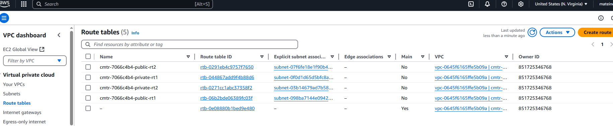

# Gitea Architecture Overview

## Project Architecture

The project uses **AWS** services to deploy and manage **Gitea**, a Git repository management system. The architecture is designed to be scalable, highly available, and fault-tolerant. The main components of the architecture are EC2 instances, RDS (Relational Database Service), EFS (Elastic File System), and a load balancer. Below is a detailed breakdown of each component and its role.

### 1. **Amazon EC2 Instances**
   - **Role**: These are the compute instances that run the Gitea application.
   - **Setup**: The EC2 instances are automatically provisioned using a **CloudFormation template** and are launched in a **private subnet**. They are configured to run **Docker** and **Docker Compose** for containerized applications.
   - **UserData Script**: Upon launch, a **UserData** script installs the required packages (including Docker and Docker Compose), configures Gitea, mounts the EFS volume, and ensures Gitea starts up in a containerized environment.
   - **Scaling**: The EC2 instances are part of an **Auto Scaling Group** to automatically scale the number of instances based on demand.

  

### 2. **Gitea (Git Repository Management)**
   - **Role**: Gitea is the core application for hosting Git repositories. It provides an easy-to-use web interface for managing repositories, users, teams, and projects.
   - **Deployment**: Gitea is deployed as a Docker container on the EC2 instances. The `docker-compose.yml` file ensures that the Gitea container is properly configured to use the MySQL database and connect to the mounted EFS for persistent storage.
   - **Configuration**: The Gitea application is configured via environment variables that are set in the `docker-compose.yml`. These variables include database connection details (host, user, password, and database name) and file storage paths.

  

  

### 3. **Amazon RDS (Relational Database Service)**
   - **Role**: RDS hosts the MySQL database used by Gitea. Gitea stores all repository data, user information, and other metadata in this database.
   - **Database Setup**: The RDS instance is provisioned as a **MySQL database** using the **AWS RDS service**. The `giteadb` database is created automatically via the **UserData script** or manually if needed.
   - **Security**: The RDS instance is placed in a **private subnet** to restrict direct internet access and ensure database security. It is accessible only from the EC2 instances via a security group.

  

### 4. **Amazon EFS (Elastic File System)**
   - **Role**: EFS provides shared storage for the Git repositories. It ensures that the repositories persist across EC2 instance reboots and scale-ups.
   - **Storage Configuration**: The EFS file system is mounted on the EC2 instances via the NFS protocol. Gitea stores all the Git repositories in `/gitea/git/repositories`, which is located on the EFS mount.
   - **Persistence**: EFS ensures that Git repositories are persistent and shared across multiple EC2 instances, allowing for horizontal scaling of the application.

  

### 5. **Amazon VPC (Virtual Private Cloud)**
   - **Role**: The VPC provides network isolation for the project. It allows for segmentation of resources into different subnets (public and private) and ensures secure communication between the components.
   - **Subnets**: 
     - **Public Subnets**: EC2 instances with access to the internet (e.g., load balancer, NAT gateway).
     - **Private Subnets**: EC2 instances, RDS, and EFS are deployed here. These resources do not have direct internet access but can communicate with the public resources like the load balancer and NAT gateway.

  

  

  

### 6. **Elastic Load Balancer (ALB - Application Load Balancer)**
   - **Role**: The ALB distributes incoming traffic to multiple EC2 instances running the Gitea application. It ensures high availability and fault tolerance.
   - **Listener Rules**: The ALB listens on port 80 for incoming HTTP traffic and forwards the traffic to the target EC2 instances based on health checks.
   - **Scaling**: As traffic increases, the ALB can distribute traffic across multiple EC2 instances managed by the Auto Scaling Group.

  

### 7. **Auto Scaling Group (ASG)**
   - **Role**: The ASG automatically adjusts the number of EC2 instances based on traffic demands.
   - **Health Checks**: The ASG uses health checks to ensure that only healthy EC2 instances are part of the load balancer. If an EC2 instance becomes unhealthy, it is replaced automatically.

  

### 8. **Security Groups**
   - **EC2 Security Group**: Configured to allow **HTTP** and **SSH** traffic for managing the Gitea application and connecting to the instance for debugging or maintenance.
   - **RDS Security Group**: Configured to allow incoming traffic on **port 3306** (MySQL) from the EC2 instances only.
   - **EFS Security Group**: Configured to allow **NFS traffic** for mounting the file system on the EC2 instances.

  

## Data Flow

1. **User Access**: 
   - Users access the Gitea web interface through the ALB, which routes the traffic to one of the EC2 instances running the Gitea container.
   - Gitea processes the requests and interacts with the MySQL database on RDS for user authentication, repository data, and other configurations.

2. **Repository Data**:
   - Gitea stores the repositories on **EFS**. This ensures that repositories are available across all EC2 instances, even if an EC2 instance is terminated or restarted.

3. **Database**:
   - Gitea interacts with the **RDS MySQL database** for storing and retrieving repository metadata, user information, and configuration settings. The MySQL database is securely hosted in a **private subnet** and is only accessible from the EC2 instances.

## Scalability and Fault Tolerance

- **Scaling**: The system is designed to scale horizontally. The **Auto Scaling Group** ensures that as demand grows, additional EC2 instances are added to handle the load.
- **Fault Tolerance**: With **Elastic Load Balancer**, **Auto Scaling Group**, and **RDS Multi-AZ deployments**, the system is fault-tolerant and highly available.
- **Data Persistence**: With **EFS** for persistent storage and **RDS** for database management, data is durable and accessible across restarts.

## Conclusion

This architecture ensures that **Gitea** is deployed in a highly available, scalable, and secure manner using AWS resources. The use of EC2 instances, RDS for the database, EFS for persistent file storage, and the Auto Scaling Group ensures that the application can handle a large number of users while maintaining high availability.

